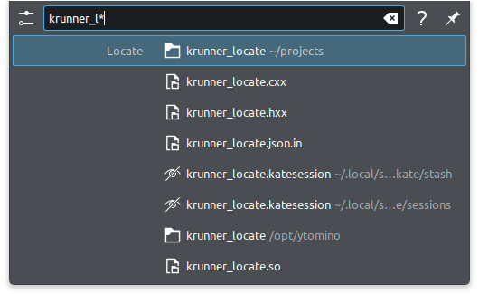
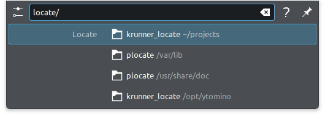

Plasma Locate Runner
====================

This is a KRunner plugin to find files and directories with locate.

Prerequisites
-------------

Qt >= 5.15
 https://www.qt.io/
KDE Frameworks >= 5.103
 https://develop.kde.org/products/frameworks/
 
 It depends on the libraries corresponding to the following Debian packages:
 
 - libkf5i18n-dev
 - libkf5runner-dev

Install
-------

::

 mkdir build
 cd build
 cmake -C ~/Downloads/krunner_locate -G 'Ninja' \
  -DCMAKE_BUILD_TYPE=Release -DKDE_INSTALL_USE_QT_SYS_PATHS=1
 ninja install

The plugin is installed to
*/usr/lib/x86_64-linux-gnu/qt5/plugins/kf5/krunner/krunner_locate.so*.

Usage
-----

This plugin is triggered by either of ``*``, ``.``, ``/``, or ``?``.

Screenshots
-----------

**Wildcard**

**Only directories**

Acknowledgement
---------------

Thanks for `VSCode Projects Runner`_ as great reference.

.. _`VSCode Projects Runner`:
   https://github.com/alex1701c/krunner-vscodeprojects
